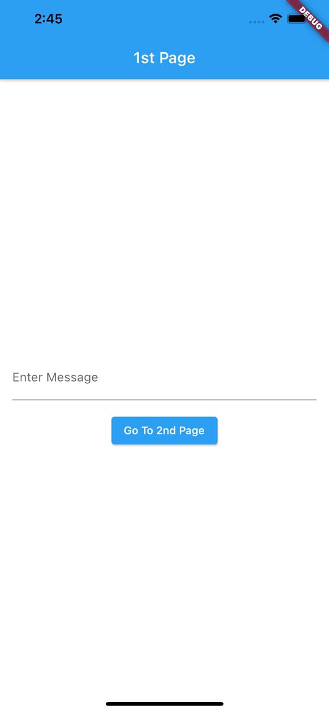
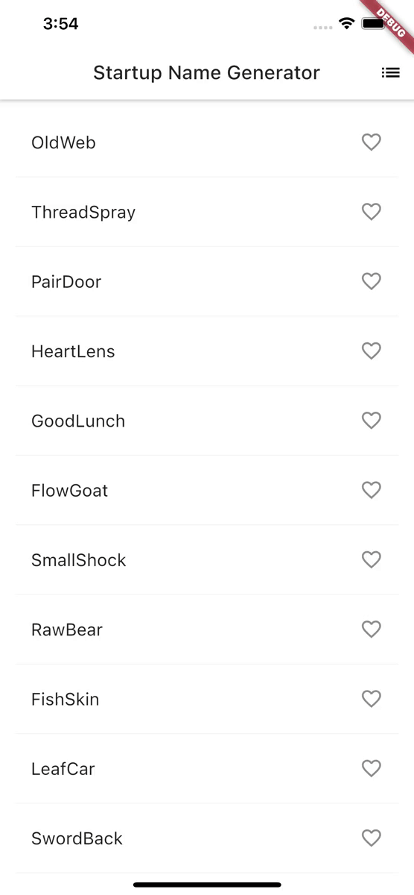
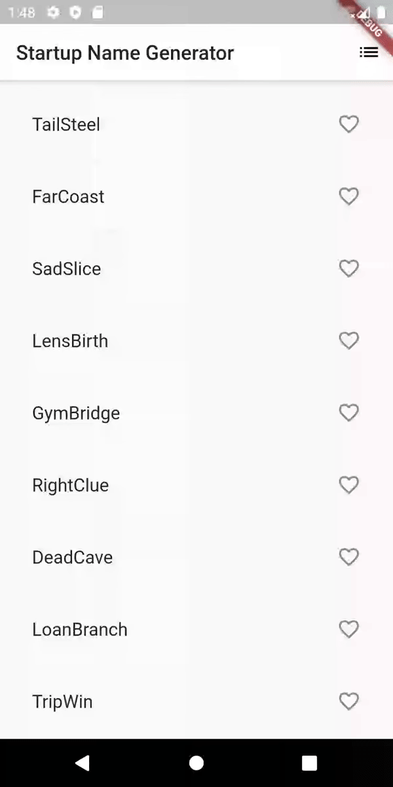

# Flutter Workshop

- [Flutter Checklist](./docs/Flutter_Checklist.pdf)
- [Setup Guide](./docs/setup.md)
- [Introduction to Flutter](./docs/Introduction_to_Flutter.pdf)

## Applications

### [Counter](./counter)

Flutter demo application

|               iOS                |               Android                |
| :------------------------------: | :----------------------------------: |
|  |  |

### [Simple Navigator](./simple_navigator)

Simple navigator with passing data between screens

|                    iOS                    |                    Android                    |
| :---------------------------------------: | :-------------------------------------------: |
|  |  |

### [Startup Namer](./startup_namer)

Startup name generator application with Flutter Codelab by Google

- [Write your first Flutter app, part 1](https://codelabs.developers.google.com/codelabs/first-flutter-app-pt1)
- [Write your first Flutter app, part 2](https://codelabs.developers.google.com/codelabs/first-flutter-app-pt2)

|                  iOS                   |                  Android                   |
| :------------------------------------: | :----------------------------------------: |
|  |  |
